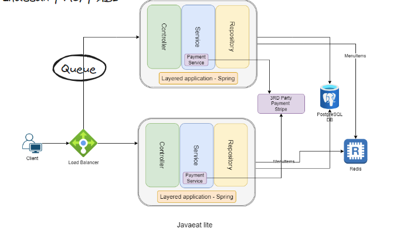
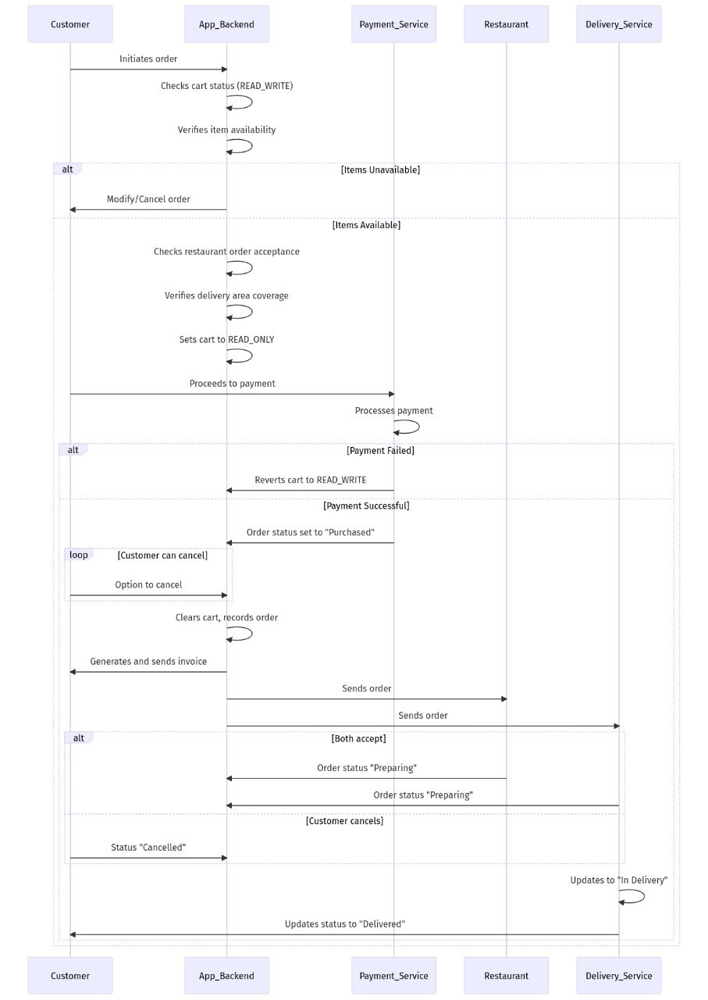
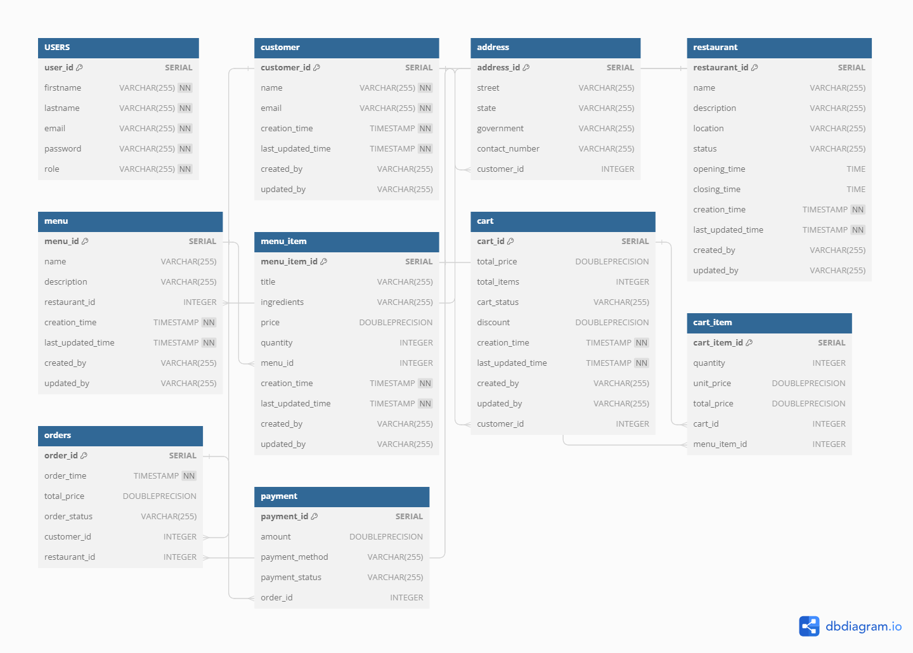
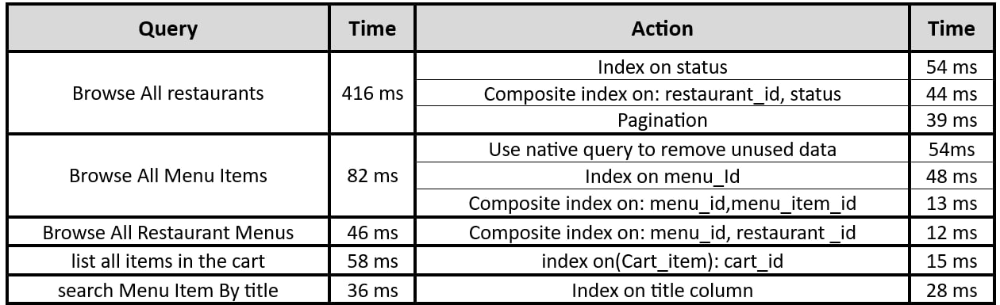
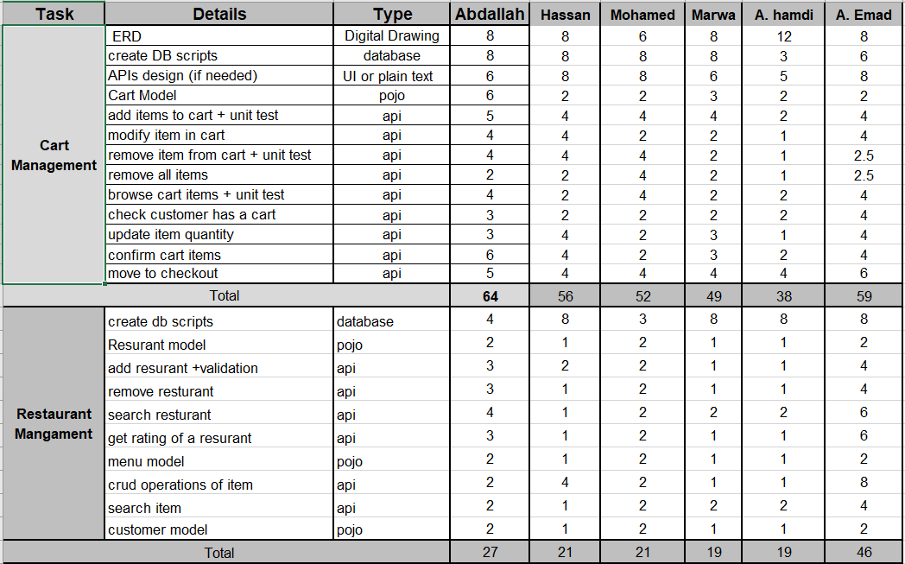

# Javeats-Lites Backend

Restaurant Management System is a Web-Based Project built with Java 11, Spring Boot 2.7, PostgresSQL.
Javeats provides a powerful foundation for managing the various aspects of restaurant operations.
It includes functionalities such as inventory management, menu creation and modification,
order processing, table reservations, customer management, staff scheduling, and financial transactions.
Leveraging the robustness and scalability of Java Spring Boot, the backend ensures efficient performance and seamless
integration with other systems.
With its modular architecture, the backend can be easily extended and customized to suit the specific needs of different
types and sizes of restaurants.
Overall, the backend system aims to optimize operational efficiency, enhance customer service, and streamline business
processes for restaurant owners and staff.

## Index

- [Getting started](#getting-started)
- [System Features](#system-features-and-use-cases)
- [Diagrams](#Diagrams)
- [Query Optimization](#query-optimization)
- [Tasks Estimation Practice](#tasks-estimation)

## Getting started

1. Built with
    - Spring Boot 2.7
    - PostgresSQL
2. Prerequisites
    - [Java 11](https://openjdk.java.net/)
    - [Maven](https://maven.apache.org/)
3. Dev run
    - `mvn clean package -DskipTests=True`
4. Start local Database, create local postgres container
    ```shell 
    docker compose up -d db
    ```
5. SWAGGER USAGE
    - Hit swagger URL in browser. [Swagger](http://localhost:9090/swagger-ui/index.html)

## System Features and Use-Cases

[Mind Map](src/main/resources/img/order_sequence_diagaram.jpeg) fo the features, use-cases, Api Endpoints, and Database
Tables.

1. Cart Management
    - add, modify, and view Cart
    - remove item or clear cart
2. User Registration and Authentication
    - Sign up, login, logout, and roles
    - Jwt Authentication
3. Restaurant Management
    - register, update, enable/disable restaurant
    - add, update, delete, enable/disable menu
    - search restaurant, menu-Items, and rating
4. Order Management
    - place and cancel order by customer or restaurant
    - order details, and restaurant orders summary
5. Payment Management
    - create, view payment and integration With 3rd Party
    - view Payment Transactions
    - generate Transaction Receipt<br>

- - - 

## Diagrams

<p align="center">

</p>
<h3 align="center">System Architecture</h3>

<p align="center">

</p>
<h3 align="center">Order Sequence Diagram</h3>

<p align="center">

</p>
<h3 align="center">Order Sequence Diagram</h3>

## Query Optimization

I performed the query optimization on Hibernate queries using `show-sql=true` property.
You can mock the tests by add 10 million records in database using
this [file](src/main/resources/data/test_data/mock-data.sql).
<p align="center">

</p>
<h3 align="center">Query Optimization Examples</h3>

## Tasks Estimation

we mocked the Task Estimation to make it better for each developer working on the system. Here is examples of it:
<p align="center">

</p>
<h3 align="center">Estimation Examples</h3>

